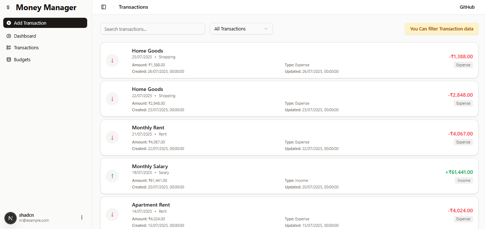
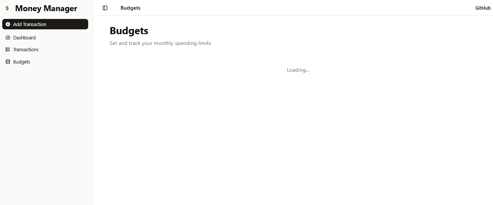
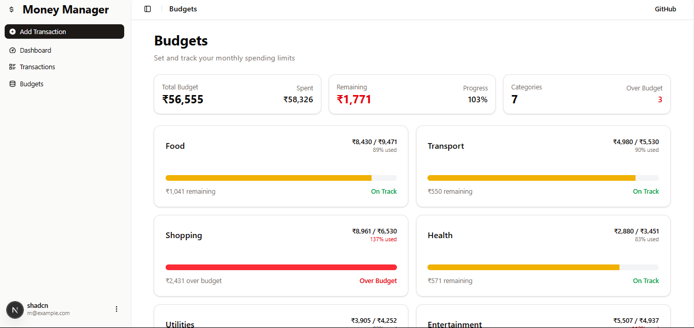

# 💰 Personal Finance Visualizer

A sleek and simple web application to **track transactions**, **analyze spending**, and **visualize your finances**—all in one place. Designed for everyday users to gain financial clarity with intuitive charts and dashboards.

[](LICENSE)  
[](https://reactjs.org)  
[](https://vercel.com)

---

## 🚀 Live Demo

👉 [Check out the live app](https://personal-finance-visualizer.vercel.app)

---

## 📸 Preview

<div align="center">

### 📊 Dashboard View  


### 📋 Transactions Page  


### 💸 Budgets Overview  


</div>

---

## 🛠️ Project Stages & Features

### ✅ **Stage 1: Basic Transaction Tracking**
- ➕ Add / ✏️ Edit / ❌ Delete transactions
- 🗂️ View transaction history
- 📅 Record amount, date, and description
- 📊 Monthly expenses bar chart
- ✅ Basic form validation

---

### ✅ **Stage 2: Categories**
- ✅ All Stage 1 features +
- 📁 Predefined categories for transactions (e.g., Food, Rent, Travel)
- 🥧 Category-wise **pie chart** for expenses
- 📈 **Dashboard** with:
  - 💸 Total monthly expenses
  - 📊 Category-wise breakdown
  - 🕒 Recent transactions list

---

### ✅ **Stage 3: Budgeting**
- ✅ All Stage 2 features +
- 🧮 Set monthly **category budgets**
- 📉 Visual **Budget vs Actual** comparison
- 🧠 Simple spending insights to improve savings

---

## 🧑‍💻 Tech Stack

- **Frontend**: React.js (Vite)
- **State Management**: React hooks + Context API
- **Charting**: Chart.js
- **Deployment**: Vercel
- **Styling**: Tailwind CSS

---

## 📁 Folder Structure (Brief)

```
Personal-Finance-Visualizer/
├── moneymanager/                    # Main Next.js application
│   ├── app/                        # Next.js app directory
│   │   ├── api/                    # API routes
│   │   │   ├── budgets/           # Budget API endpoints
│   │   │   ├── dashboard/         # Dashboard API endpoints
│   │   │   └── transactions/      # Transaction API endpoints
│   │   ├── budgets/               # Budget pages
│   │   ├── charts-demo/           # Chart demonstration pages
│   │   ├── dashboard/             # Dashboard pages
│   │   └── transactions/          # Transaction pages
│   ├── components/                 # React components
│   │   ├── charts/                # Chart components
│   │   └── ui/                    # Reusable UI components
│   ├── hooks/                     # Custom React hooks
│   ├── lib/                       # Utility libraries
│   │   └── models/                # Data models
│   ├── public/                    # Static assets
│   ├── package.json               # Dependencies and scripts
│   ├── tsconfig.json              # TypeScript configuration
│   └── README.md                  # Project documentation
└── README.md 
```

---

## 🏁 Getting Started

### 1. Clone the repository

```bash
git clone https://github.com/yashpardhi2403/Personal-Finance-Visualizer.git
cd Personal-Finance-Visualizer
```

### 2. Install dependencies

```bash
npm install
```

### 3. Start the development server

```bash
npm run dev
```

---

## ✨ Contributing

Contributions are welcome!  
Open an issue, suggest an enhancement, or create a pull request.

---

## 📄 License

This project is licensed under the [MIT License](LICENSE).

---

## 👨‍💻 Author

**Yash Pardhi**  
🌐 [GitHub](https://github.com/yashpardhi2403) • ✉️ yashpardhi2403@gmail.com

---
